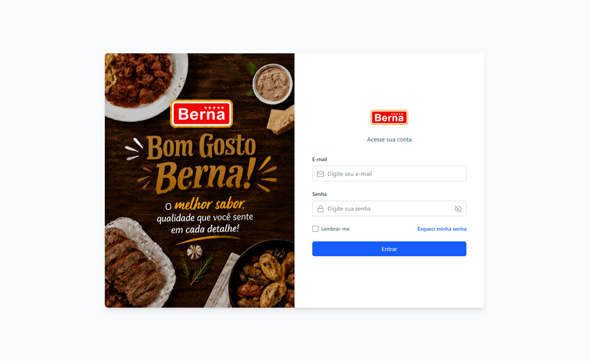
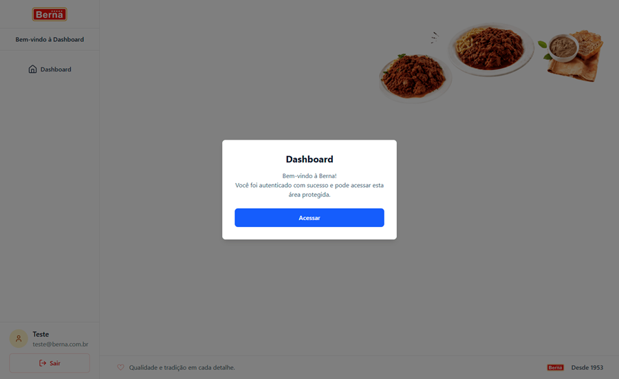
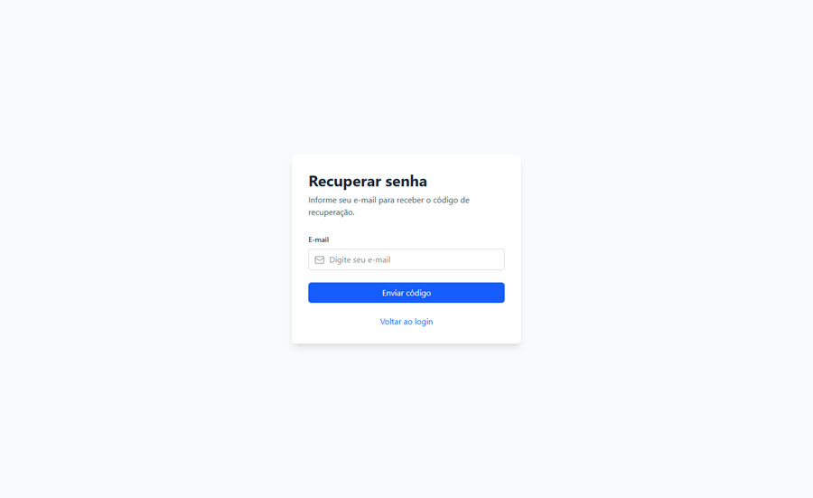
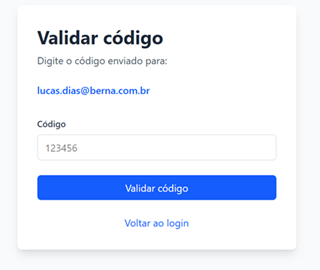
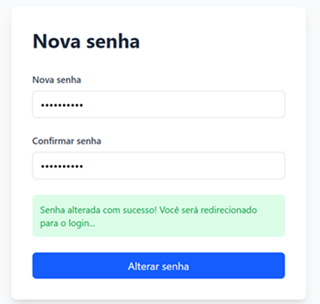
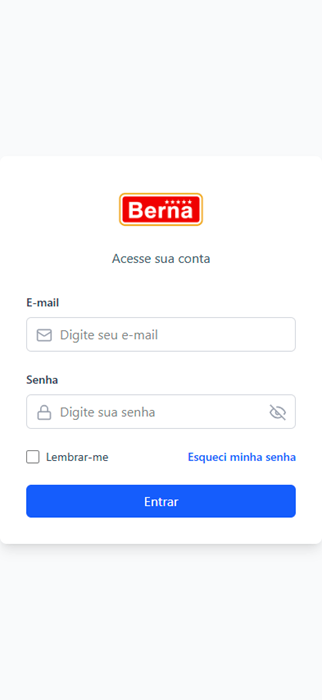
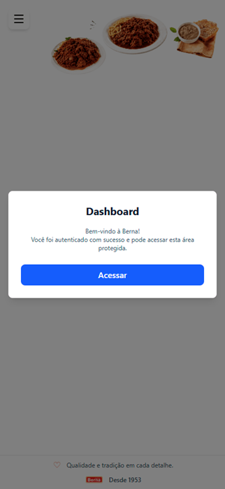

<p align="center">
  
</p>

<br>

<p align="center">
  Desafio Técnico • Desenvolvedor Júnior
</p>

<div align="center">

<p align="center">


</p>

</div>

<h1 align="center">Sobre o Projeto</h1>

O objetivo deste desafio consiste em desenvolver uma interface de autenticação, segura e responsiva utilizando a seguinte stack tecnológica:

- React.js
- GitHub
- Vercel
- Tailwind CSS

Os requisitos principais definidos foram:

- Formulário de Login;
- Validação dos dados;
- Feedback visual para o usuário;
- Dashboard protegido;
- Rotas Privadas;
- Responsividade;
- README explicando a solução;
- Deploy da aplicação utilizando Vercel.

Também foram sugeridas boas práticas relacionadas a:

- Clean Code;
- Testes Unitários;
- UX/UI;
- Segurança;
- Organização do projeto.

O projeto busca atender integralmente aos requisitos obrigatórios do desafio, incorporando também melhorias voltadas à qualidade de código, organização da arquitetura, documentação e experiência do usuário.

Todo o desenvolvimento deste repositório foi realizado tomando o documento do desafio como referência.

---

# Índice

- [Índice](#índice)
  - [Telas](#telas)
    - [Login](#login)
    - [Dashboard](#dashboard)
    - [Recuperação de Senha](#recuperação-de-senha)
    - [Verificação de Código](#verificação-de-código)
    - [Redefinição de Senha](#redefinição-de-senha)
  - [Responsividade](#responsividade)
    - [Testes de Responsividade Mobile](#testes-de-responsividade-mobile)
    - [Login](#login-1)
    - [Dashboard](#dashboard-1)
- [Deploy](#deploy)
- [Tecnologias Utilizadas](#tecnologias-utilizadas)
  - [Front-end](#front-end)
  - [Qualidade de Código](#qualidade-de-código)
  - [Configuração do Editor](#configuração-do-editor)
  - [Testes](#testes)
  - [Automação](#automação)
  - [Versionamento](#versionamento)
  - [Deploy](#deploy-1)
- [Requisitos e Checklist](#requisitos-e-checklist)
  - [Requisitos do Desafio](#requisitos-do-desafio)
  - [Implementação Técnica](#implementação-técnica)
- [Funcionalidades Implementadas](#funcionalidades-implementadas)
  - [Login](#login-2)
  - [Dashboard](#dashboard-2)
  - [Validações](#validações)
- [Melhorias Implementadas](#melhorias-implementadas)
  - [Qualidade de Código](#qualidade-de-código-1)
  - [Testes](#testes-1)
  - [Validação Local](#validação-local)
  - [Experiência do Usuário (UX/UI)](#experiência-do-usuário-uxui)
  - [Recuperação de Senha](#recuperação-de-senha-1)
  - [Documentação](#documentação)
- [Estrutura do Projeto](#estrutura-do-projeto)
- [Arquitetura](#arquitetura)
  - [Pages](#pages)
  - [Components](#components)
  - [Services](#services)
  - [Utils](#utils)
  - [Constants](#constants)
  - [Routes](#routes)
  - [Assets](#assets)
  - [Styles](#styles)
  - [Testes](#testes-2)
- [Como Executar o Projeto](#como-executar-o-projeto)
  - [Pré-requisitos](#pré-requisitos)
  - [Clonando o repositório](#clonando-o-repositório)
  - [Instalando as dependências](#instalando-as-dependências)
  - [Executando em modo de desenvolvimento](#executando-em-modo-de-desenvolvimento)
  - [Gerando a versão de produção](#gerando-a-versão-de-produção)
  - [Visualizando a build localmente](#visualizando-a-build-localmente)
- [Scripts Disponíveis](#scripts-disponíveis)
- [Testes](#testes-3)
  - [Cobertura atual](#cobertura-atual)
- [Integração Contínua (CI)](#integração-contínua-ci)
- [Qualidade Local](#qualidade-local)
- [Segurança](#segurança)
  - [Possível Integração com Banco de Dados](#possível-integração-com-banco-de-dados)
  - [Organização por responsabilidades](#organização-por-responsabilidades)
  - [Componentização](#componentização)
  - [Validações centralizadas](#validações-centralizadas)
  - [Simulação de autenticação](#simulação-de-autenticação)
- [Documentação](#documentação-1)
  - [Documentação técnica](#documentação-técnica)
  - [Guias de configuração](#guias-de-configuração)
- [Melhorias Futuras](#melhorias-futuras)
- [Referências](#referências)

---

## Telas

### Login



---

### Dashboard



---

### Recuperação de Senha



---

### Verificação de Código



---

### Redefinição de Senha



---

## Responsividade

Interface desenvolvida utilizando **React** e **Tailwind CSS v4**, priorizando uma experiência consistente em diferentes resoluções de tela, desde dispositivos móveis até monitores ultrawide.

Durante o desenvolvimento foram realizados testes manuais nos seguintes tamanhos de tela:

| Dispositivo     | Largura |
| --------------- | ------: |
| Celular pequeno |  375 px |
| Celular grande  |  430 px |
| Tablet          |  768 px |
| Notebook        | 1366 px |
| Full HD         | 1920 px |
| Ultrawide       | 2560 px |

Foram validados os seguintes aspectos em cada resolução:

- Layout responsivo;
- Alinhamento dos componentes;
- Espaçamentos;
- Legibilidade dos textos;
- Dimensionamento das imagens;
- Campos do formulário;
- Botões;
- Navegação entre páginas;
- Dashboard autenticado.

---

### Testes de Responsividade Mobile

### Login



---

### Dashboard



---

# Deploy

O deploy da aplicação foi realizado utilizando a **Vercel**, conforme especificado no desafio.

Após a publicação, a plataforma executará automaticamente:

- Instalação das dependências;
- Build da aplicação;
- Publicação da versão de produção.

A aplicação está disponível em ambiente de produção no endereço abaixo:

**Deploy em Produção**

[Link da aplicação publicada na Vercel](https://desafio-tecnico-berna-lucasitdev.vercel.app/)

**Repositório**

[desafio-tecnico-berna](https://github.com/lucasitdias/desafio-tecnico-berna)

---

# Tecnologias Utilizadas

## Front-end

- React 19
- React Router DOM
- Vite
- Tailwind CSS v4
- Lucide React

## Qualidade de Código

- ESLint
- Prettier

## Configuração do Editor

- EditorConfig

## Testes

- Vitest
- Testing Library
- JSDOM

## Automação

- Husky
- GitHub Actions

## Versionamento

- Git
- GitHub

## Deploy

- Vercel

---

# Requisitos e Checklist

Abaixo estão os requisitos definidos no desafio e os itens adicionais relacionados à implementação do projeto.

## Requisitos do Desafio

- [x] Formulário de Login
- [x] Validação de E-mail
- [x] Validação de Senha
- [x] Feedback visual de erro
- [x] Estado de loading durante autenticação
- [x] Dashboard protegido
- [x] Rotas Privadas
- [x] Responsividade
- [x] README do projeto
- [x] Deploy na Vercel

## Implementação Técnica

- [x] React
- [x] Tailwind CSS
- [x] Testes Unitários

---

# Funcionalidades Implementadas

## Login

- Campo de e-mail;
- Campo de senha;
- Mostrar/Ocultar senha;
- Checkbox "Lembrar-me";
- Navegação para recuperação de senha;
- Feedback visual de autenticação;
- Estado de carregamento durante autenticação;
- Redirecionamento após login bem-sucedido.

---

## Dashboard

- Área protegida por autenticação;
- Navegação segura;
- Logout;

---

## Validações

- Validação de e-mail;
- Validação de senha;
- Mensagens de erro;
- Controle de autenticação via serviço mock.

---

# Melhorias Implementadas

Além dos requisitos mínimos solicitados pelo desafio, foram implementadas melhorias voltadas à qualidade do desenvolvimento, padronização e manutenção do projeto.

## Qualidade de Código

- ESLint configurado;
- Prettier configurado;

---

## Testes

- Testes unitários com Vitest;
- Testing Library;
- JSDOM configurado.

---

## Validação Local

- Husky para validação antes dos commits;
- Execução automática de:
  - ESLint;
  - Prettier;
  - Testes unitários.

## Experiência do Usuário (UX/UI)

Além dos requisitos funcionais do desafio, foram adicionados alguns elementos para melhorar a experiência de navegação.

- Mostrar/Ocultar senha no formulário de login;
- Feedback visual durante autenticação;
- Modal de boas-vindas no Dashboard.

## Recuperação de Senha

- Solicitação de recuperação por e-mail;
- Envio de código de verificação (Mock);
- Validação do código informado;
- Redefinição da senha.

---

## Documentação

O projeto possui documentação separada por assunto, contemplando:

- Planejamento;
- Arquitetura;
- Desenvolvimento;
- Segurança;
- CI/CD;
- Deploy;
- Guias de configuração do ambiente;
- Configuração de testes;
- Checklist final do projeto.

# Estrutura do Projeto

O projeto foi organizado seguindo o princípio de separação de responsabilidades, facilitando manutenção, escalabilidade e reutilização dos componentes.

```text
desafio-tecnico-berna/
│
├── .github/                 # Workflows e templates do GitHub
│   ├── issue_template/
│   └── workflows/
│
├── .husky/                  # Hooks de pré-commit
│
├── docs/                    # Documentação técnica
│   ├── img/                 # Imagens dos testes
│   ├── 00-planejamento-geral.md
│   ├── 01-planejamento.md
│   ├── 02-requisitos.md
│   ├── 03-gitflow.md
│   ├── 04-arquitetura.md
│   ├── 05-desenvolvimento.md
│   ├── 06-seguranca.md
│   ├── 07-ci-cd.md
│   ├── 08-deploy.md
│   └── 09-checklist.md
│
├── guides/                  # Guias de configuração
│   ├── 10-preparacao-ambiente.md
│   ├── ...
│   └── 20-configuracao-testes.md
│
├── public/
│
├── src/
│   ├── assets/
│   ├── components/
│   ├── constants/
│   ├── pages/
│   ├── routes/
│   ├── services/
│   ├── styles/
│   ├── test/
│   ├── utils/
│   ├── App.jsx
│   └── main.jsx
│
├── .env.example
├── package.json
├── vite.config.js
└── README.md
```

---

# Arquitetura

Arquitetura baseada em responsabilidades, mantendo cada camada responsável por uma única função dentro da aplicação.

## Pages

Responsáveis pela composição das telas e orquestração dos componentes.

```text
src/pages/
```

Exemplos:

- Login
- Dashboard
- Recuperação de senha
- Verificação de código
- Redefinição de senha

---

## Components

Contêm componentes reutilizáveis da interface.

```text
src/components/
```

Exemplos:

- Button
- Input
- FeedbackMessage
- Sidebar
- Footer
- DashboardWelcomeModal
- PageTitle

---

## Services

Responsáveis pelas regras de acesso aos serviços da aplicação.

Foi utilizada uma autenticação mockada através de Promises para simular uma API.

```text
src/services/
```

---

## Utils

Contém funções utilitárias reutilizáveis.

```text
src/utils/
```

Exemplo:

- Validação de e-mail
- Validação de senha

---

## Constants

Centraliza constantes utilizadas pela aplicação.

```text
src/constants/
```

---

## Routes

Responsável pelo gerenciamento das rotas públicas e privadas.

```text
src/routes/
```

Inclui a proteção da Dashboard através da `PrivateRoute`.

---

## Assets

Armazena imagens utilizadas pela aplicação.

```text
src/assets/
```

---

## Styles

Centraliza os estilos globais da aplicação.

```text
src/styles/
```

---

## Testes

Configuração do ambiente de testes e testes auxiliares.

```text
src/test/
```

---

# Como Executar o Projeto

## Pré-requisitos

É necessário possuir instalado:

- Node.js (versão utilizada no desenvolvimento: 24.x)
- npm (gerenciador de pacotes incluso no Node.js)
- Git

---

## Clonando o repositório

```bash
git clone https://github.com/lucasitdias/desafio-tecnico-berna.git
```

```bash
cd desafio-tecnico-berna
```

---

## Instalando as dependências

```bash
npm install
```

Caso existam problemas de cache ou dependências antigas, execute:

---

## Executando em modo de desenvolvimento

```bash
npm run dev
```

A aplicação ficará disponível em:

```text
http://localhost:5173
```

---

## Gerando a versão de produção

```bash
npm run build
```

---

## Visualizando a build localmente

```bash
npm run preview
```

---

# Scripts Disponíveis

| Script                 | Descrição                                  |
| ---------------------- | ------------------------------------------ |
| `npm run dev`          | Inicia o servidor de desenvolvimento       |
| `npm run build`        | Gera a versão de produção                  |
| `npm run preview`      | Executa a build localmente                 |
| `npm run lint`         | Executa o ESLint                           |
| `npm run format`       | Formata todo o projeto utilizando Prettier |
| `npm run format:check` | Verifica a formatação do projeto           |
| `npm test`             | Executa todos os testes unitários          |
| `npm run test:watch`   | Executa os testes em modo observação       |
| `npm run test:ui`      | Executa a interface gráfica do Vitest      |

---

# Testes

O projeto utiliza **Vitest** como framework de testes unitários e **Testing Library** para configuração do ambiente de testes.

Atualmente foram implementados testes para as regras de validação da aplicação, garantindo que alterações futuras não comprometam o funcionamento das funções críticas.

## Cobertura atual

- Validação de e-mail (`validateEmail`)
- Validação de senha (`validatePassword`)
- Configuração do ambiente de testes

Os testes podem ser executados através dos comandos:

```bash
npm test
```

ou

```bash
npm run test:watch
```

---

# Integração Contínua (CI)

O projeto possui um workflow de **GitHub Actions** responsável por validar automaticamente a qualidade da aplicação sempre que ocorre um **Push** ou **Pull Request** para as branches principais do projeto.

Durante a execução da pipeline são realizadas as seguintes etapas:

- Instalação das dependências;
- Análise estática com ESLint;
- Verificação da formatação com Prettier;
- Execução dos testes unitários;
- Geração da build de produção.

Fluxo da pipeline:

```text
Push / Pull Request
        │
        ▼
npm ci
        │
        ▼
ESLint
        │
        ▼
Prettier
        │
        ▼
Vitest
        │
        ▼
Build
        │
        ▼
Workflow aprovado
```

Essa validação automática ajuda a garantir que apenas código válido seja integrado ao projeto.

---

# Qualidade Local

Antes de cada commit, o projeto executa automaticamente um conjunto de validações através do **Husky**.

São executadas as seguintes verificações:

- ESLint;
- Prettier;
- Testes unitários.

Caso alguma dessas etapas falhe, o commit é interrompido até que o problema seja corrigido.

---

# Segurança

Embora o desafio utilize autenticação simulada (Mock), algumas boas práticas foram adotadas durante o desenvolvimento.

- Separação das regras de autenticação em Services;
- Rotas privadas para proteção da Dashboard;
- Validação dos dados antes da autenticação;
- Arquivo `.env.example` preparado para futuras integrações;
- Nenhuma informação sensível versionada no repositório.

Atualmente o projeto não utiliza:

- Banco de dados;
- API externa;
- Tokens;
- Chaves de acesso;
- Variáveis de ambiente obrigatórias.

## Possível Integração com Banco de Dados

Durante a análise das tecnologias sugeridas para o desafio, pesquisei sobre a utilização do **Neon PostgreSQL** como uma possível solução de persistência de dados.

O Neon seria uma alternativa interessante para uma evolução futura da aplicação, principalmente para cenários onde fosse necessário armazenar informações como:

- Usuários cadastrados;
- Dados de autenticação;
- Histórico de acessos;
- Preferências do usuário;
- Informações relacionadas ao perfil.

---

## Organização por responsabilidades

A aplicação foi estruturada separando responsabilidades entre páginas, componentes, serviços e utilitários.

Exemplos:

- `pages` → telas da aplicação;
- `components` → componentes reutilizáveis;
- `services` → regras de comunicação e autenticação;
- `utils` → funções auxiliares;
- `constants` → valores compartilhados;
- `routes` → gerenciamento das rotas.

---

## Componentização

A interface foi dividida em componentes independentes, permitindo maior reutilização e facilitando futuras alterações.

---

## Validações centralizadas

As regras de validação foram isoladas em utilitários específicos, permitindo reutilização e manutenção simplificada.

---

## Simulação de autenticação

A autenticação foi implementada utilizando Promises para simular o comportamento de uma API, conforme proposto pelo desafio.

---

# Documentação

Além deste README, o projeto possui documentação organizada em duas áreas.

## Documentação técnica

```text
docs/
```

Contém documentos relacionados ao planejamento, arquitetura, desenvolvimento, segurança, CI/CD, deploy e checklist final do projeto.

## Guias de configuração

```text
guides/
```

Contém guias utilizados durante a preparação do ambiente de desenvolvimento, configuração das ferramentas e validação do projeto.

Essa organização permite separar a documentação de arquitetura da documentação operacional, facilitando a consulta e manutenção do projeto.

---

# Melhorias Futuras

Algumas melhorias poderiam ser implementadas em uma evolução futura do projeto.

- Integração com uma API real de autenticação;
- Persistência de usuários em banco de dados;
- Autenticação utilizando JWT;
- Controle de renovação da sessão;
- Rate Limit para proteção contra ataques de força bruta;
- Recuperação de senha integrada a serviço de e-mail;
- Testes de componentes e testes de integração;
- Monitoramento da aplicação;
- Aumento da cobertura de testes automatizados.

---

# Referências

- React → [Site Oficial](https://react.dev/) | [Documentação](https://react.dev/)
- React Router DOM → [Site Oficial](https://reactrouter.com/) | [Documentação](https://reactrouter.com/start/declarative/installation)
- Vite → [Site Oficial](https://vite.dev/) | [Documentação](https://vite.dev/guide/)
- Tailwind CSS → [Site Oficial](https://tailwindcss.com/) | [Documentação](https://tailwindcss.com/docs)
- Lucide React → [Site Oficial](https://lucide.dev/) | [Documentação](https://lucide.dev/guide/packages/lucide-react)
- Vitest → [Site Oficial](https://vitest.dev/) | [Documentação](https://vitest.dev/guide/)
- Testing Library → [Site Oficial](https://testing-library.com/) | [Documentação](https://testing-library.com/docs/)
- JSDOM → [Repositório](https://github.com/jsdom/jsdom) | [Documentação](https://github.com/jsdom/jsdom#readme)
- ESLint → [Site Oficial](https://eslint.org/) | [Documentação](https://eslint.org/docs/latest/)
- Prettier → [Site Oficial](https://prettier.io/) | [Documentação](https://prettier.io/docs/)
- EditorConfig → [Site Oficial](https://editorconfig.org/) | [Documentação](https://editorconfig.org/)
- Husky → [Site Oficial](https://typicode.github.io/husky/) | [Documentação](https://typicode.github.io/husky/)
- Git → [Site Oficial](https://git-scm.com/) | [Documentação](https://git-scm.com/doc)
- GitHub → [Site Oficial](https://github.com/) | [Documentação](https://docs.github.com/)
- GitHub Actions → [Site Oficial](https://github.com/features/actions) | [Documentação](https://docs.github.com/actions)
- Vercel → [Site Oficial](https://vercel.com/) | [Documentação](https://vercel.com/docs)

---

<div align="center">

<p><strong><font size="5">👨‍💻 Lucas Luigi Dias Custodio</font></strong></p>

Estudante do **4º semestre de Ciência da Computação**, com foco em **Desenvolvimento de Software**, **Qualidade de Código**, **Infraestrutura** e **Boas Práticas**.

<p>
  <a href="https://github.com/lucasitdias" target="_blank">
    
  </a>

  <a href="https://www.linkedin.com/in/lucasitdias/" target="_blank">
    
  </a>
</p>

</div>

---

Projeto foi desenvolvido para fins de avaliação, como parte do **Desafio Técnico Berna**.

O código permanece disponível para fins de estudo e demonstração de conhecimento técnico.

---
